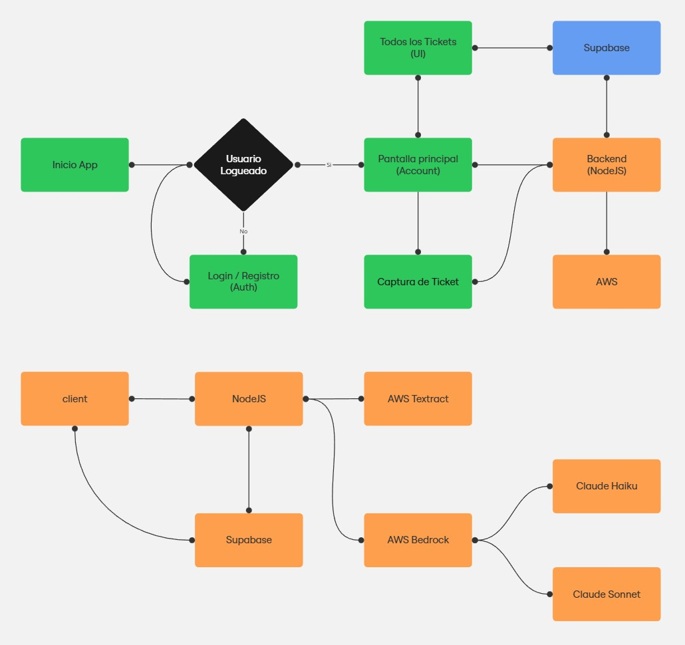

# FinanzApp


Aplicación móvil que automatiza el registro de gastos mediante escaneo inteligente de tickets. Utiliza **OCR** y **IA** para extraer y estructurar información de compras, facilitando el seguimiento financiero personal.

## 🎯 Características Principales

- **📸 Escaneo Inteligente**: Captura tickets con la cámara y extrae automáticamente productos, precios y totales usando AWS Textract
- **🤖 Procesamiento con IA**: Claude 3 (AWS Bedrock) estructura y categoriza los datos de compra
- **📊 Dashboard Analítico**: Visualiza gastos, estadísticas y análisis de descuentos por supermercado
- **💾 Sincronización en Tiempo Real**: Base de datos PostgreSQL en Supabase con autenticación integrada
- **🚀 Arquitectura Escalable**: Backend en Node.js/Express desplegado en AWS con Docker

## 🏗️ Arquitectura



Ver [documentación técnica completa](docs/) para detalles de implementación.

## 🛠️ Stack Tecnológico

- **Frontend**: React Native + Expo (TypeScript)
- **Backend**: Node.js + Express + TypeScript
- **Base de datos**: Supabase (PostgreSQL)
- **IA**: AWS Bedrock (Claude 3 Haiku)
- **OCR**: AWS Textract
- **Deployment**: AWS EC2 + CloudFront, EAS Build

## 🚀 Quick Start

### Frontend (Desarrollo)

```bash
cd frontend
npm install
npx expo start
```

### Backend (Local)

```bash
cd backend/aws-api
cp .env.example .env  # Configura tus credenciales
npm install
npm run dev
```

## 📦 Estructura del Proyecto

```
finanzapp/
├── frontend/          # App React Native (Expo)
│   ├── app/          # Rutas y navegación
│   └── src/          # Componentes, servicios, hooks
├── backend/
│   └── aws-api/      # API Node.js/Express
│       ├── src/
│       │   ├── controllers/
│       │   ├── services/  # Textract, Bedrock, DB
│       │   └── routes/
│       └── Dockerfile
└── docs/             # Documentación técnica
```

## 📚 Documentación

- **Deploy Backend**: [docs/deploy-backend.md](docs/deploy-backend.md)
- **Deploy Mobile**: [docs/deploy-mobile.md](docs/deploy-mobile.md)
- **Configuración AWS**: [docs/aws-setup.md](docs/aws-setup.md)

## ⚙️ Configuración

Copia `.env.example` en cada módulo y configura:

- **AWS**: Credenciales IAM (Bedrock + Textract)
- **Supabase**: URL del proyecto y service role key
- **Backend URL**: Para el cliente móvil (producción)

## 📄 Licencia

Uso privado - Brollix © 2025
