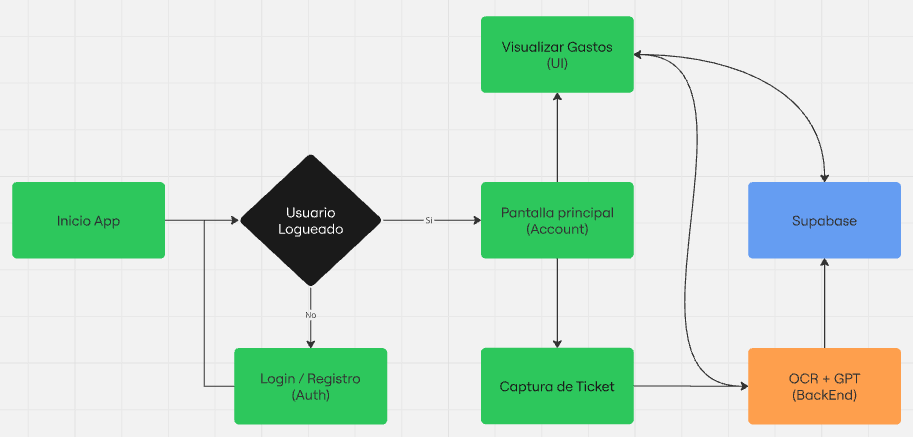

<div align="center">
  <h1>💸 Finanzapp</h1>
  
  <p><strong>Finanzapp</strong> es una aplicación de microfinanzas personales que permite capturar tickets físicos, extraer automáticamente los datos relevantes y llevar un control de gastos de forma simple e intuitiva. Está desarrollada con una arquitectura modular y escalable, separando el frontend móvil del backend de procesamiento.</p>
</div>

---

## 🚀 Arquitectura del Proyecto

El proyecto es un monorepo que contiene tres componentes principales:

-   `./frontend`: Aplicación móvil desarrollada con **Expo (React Native)**. Se encarga de la interfaz de usuario, la captura de imágenes y la comunicación con los servicios de backend y Supabase.
-   `./ocr-api`: Servicio de backend en **Python** y **Docker** que utiliza **PaddleOCR** para extraer el texto crudo de las imágenes de los tickets.
-   `./gpt-api`: Servicio de backend en **Python** que recibe el texto extraído y utiliza un modelo de lenguaje local (LLM) para analizarlo y formatearlo en un JSON estructurado.

<div align="center">
  
</div>

---

## 🛠️ Prerrequisitos

Antes de empezar, asegúrate de tener instalado el siguiente software:

-   **Node.js** (v18 o superior) y **npm**
-   **Python** (v3.9 o superior) y **pip**
-   **Docker** y **Docker Compose**
-   **Git**

---

## ⚙️ Guía de Instalación y Ejecución

Sigue estos pasos para configurar y correr el proyecto completo en tu máquina local.

### 1. Clonar el Repositorio

```bash
git clone https://github.com/tu-usuario/finanzapp.git
cd finanzapp
```

### 2. Configurar el Frontend (Expo)

1.  **Navega al directorio del frontend:**
    ```bash
    cd frontend
    ```

2.  **Crea tu archivo de variables de entorno:**
    Copia el archivo de ejemplo `.env.example` a un nuevo archivo llamado `.env.local`.
    ```bash
    cp .env.example .env.local
    ```

3.  **Configura las variables en `.env.local`:**
    Abre el archivo `.env.local` y reemplaza los valores de ejemplo con tus propias claves de Supabase y la URL de la API.

4.  **Instala las dependencias:**
    ```bash
    npm install
    ```

5.  **Ejecuta la aplicación:**
    Inicia el servidor de desarrollo de Expo. Podrás abrir la app en un emulador o en tu teléfono físico con la app de Expo Go.
    ```bash
    npm start
    ```

### 3. Ejecutar la API de OCR (Docker)

La API de OCR está containerizada para facilitar su ejecución.

1.  **Navega al directorio de la API de OCR:**
    ```bash
    cd ocr-api # (Desde la raíz del proyecto)
    ```

2.  **Construye y ejecuta el contenedor:**
    Docker Compose se encargará de todo. El servicio estará disponible en el puerto `8000`.
    ```bash
    docker-compose up --build
    ```

### 4. Configurar y Ejecutar la API de GPT (Python)

Esta API requiere la descarga manual de un modelo de lenguaje.

1.  **Navega al directorio de la API de GPT:**
    ```bash
    cd gpt-api # (Desde la raíz del proyecto)
    ```

2.  **Descarga el Modelo de Lenguaje (LLM):**
    Este repositorio **no incluye** el archivo del modelo (`.gguf`) por su gran tamaño. Debes descargarlo por separado.
    -   **Modelo:** `Nous-Hermes-2-Mistral-7B-DPO.Q4_K_M.gguf`
    -   **Descárgalo desde:** [Hugging Face](https://huggingface.co/TheBloke/Nous-Hermes-2-Mistral-7B-DPO-GGUF/blob/main/nous-hermes-2-mistral-7b-dpo.Q4_K_M.gguf)
    -   **Importante:** Coloca el archivo `.gguf` descargado dentro de la carpeta `gpt-api/`.

3.  **Crea y activa un entorno virtual:**
    Es una buena práctica aislar las dependencias de Python.
    ```bash
    python -m venv venv
    source venv/bin/activate  # En Linux/macOS
    # venv\Scripts\activate   # En Windows
    ```

4.  **Instala las dependencias:**
    ```bash
    pip install -r requirements.txt
    ```

5.  **Ejecuta el servidor de la API:**
    El servicio se iniciará, por defecto, en el puerto `8080`.
    ```bash
    python main.py
    ```

---

## 👨‍💻 Autor

Desarrollado por [Agustín (Brollix)](https://github.com/Brollix) como un proyecto personal para aplicar tecnologías modernas a un problema cotidiano.
