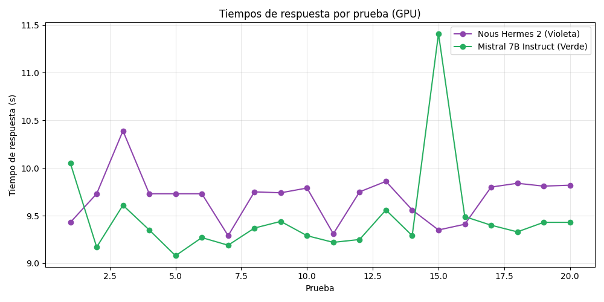

# Stress Test de Llama-CPP Python API (GPU)

**Fecha:** 2025-07-05

### Tiempos individuales (Nous Hermes 2 Mistral 7B)
```
Prueba  1:  9.43 s
Prueba  2:  9.73 s
Prueba  3: 10.39 s
Prueba  4:  9.73 s
Prueba  5:  9.73 s
Prueba  6:  9.73 s
Prueba  7:  9.29 s
Prueba  8:  9.75 s
Prueba  9:  9.74 s
Prueba 10:  9.79 s
Prueba 11:  9.31 s
Prueba 12:  9.75 s
Prueba 13:  9.86 s
Prueba 14:  9.56 s
Prueba 15:  9.35 s
Prueba 16:  9.41 s
Prueba 17:  9.80 s
Prueba 18:  9.84 s
Prueba 19:  9.81 s
Prueba 20:  9.82 s
```

### Tiempos individuales (Mistral 7B Instruct v0.2)
```
Prueba  1: 10.05 s
Prueba  2:  9.17 s
Prueba  3:  9.61 s
Prueba  4:  9.35 s
Prueba  5:  9.08 s
Prueba  6:  9.27 s
Prueba  7:  9.19 s
Prueba  8:  9.37 s
Prueba  9:  9.44 s
Prueba 10:  9.29 s
Prueba 11:  9.22 s
Prueba 12:  9.25 s
Prueba 13:  9.56 s
Prueba 14:  9.29 s
Prueba 15: 11.41 s
Prueba 16:  9.49 s
Prueba 17:  9.40 s
Prueba 18:  9.33 s
Prueba 19:  9.43 s
Prueba 20:  9.43 s
```

## Estadísticas comparativas

| Modelo                       | Promedio (s) | Máximo (s) | Mínimo (s) | Delta (s) |
|------------------------------|:------------:|:----------:|:----------:|:---------:|
| Nous Hermes 2 Mistral 7B     |    9.66      |   10.39    |   9.29     |   1.10    |
| Mistral 7B Instruct v0.2     |    9.48      |   11.41    |   9.08     |   2.33    |

- **Promedio:** Tiempo medio de respuesta en 20 pruebas.
- **Máximo:** Tiempo más alto registrado.
- **Mínimo:** Tiempo más bajo registrado.
- **Delta:** Diferencia entre máximo y mínimo.



## Conclusión
- Ambos modelos son rápidos y estables en GPU.
- Mistral 7B Instruct v0.2 es preferible para extracción automática.
- Nous Hermes 2 es mejor para prompts complejos o conversación informal.
